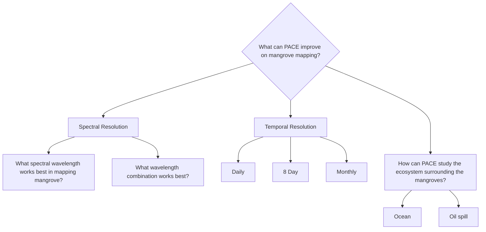

# proj-blue-monday

## Overview

## Planning

## Collaborators

| Name                | Role                |
|---------------------|---------------------|
| Rose Coggins        | Project Facilitator |
| Janelle Levine      | Participant         |
| Michelle Fasona     | Participant         |
| Shulhan             | Participant         |

## Planning

* Initial idea: "Comparative analysis showing what hyperspectral PACE data can add to mangrove species or stress discrimination, with a short methods write-up. Can PACE improve mangrove mapping, helping to create future assessments for blue carbon storage."
* Ideation jam board: N/A
* Ideation Presentation: [Add link](https://docs.google.com/document/d/1I7gEBj5eX1U0ilyhCWnXOmdy7NIzD_fqiL9HvNIqZoM/edit?tab=t.0#heading=h.q17budsrtwbp)
* Slack channel: proj-blue-monday
* Project google drive: [Add link](https://drive.google.com/drive/folders/1RytJEL6RyTIa2q_Iula9L8nYh0vT8LyI)
* Final presentation: [Add link](https://www.canva.com/design/DAG_1A26HGU/t7hjW5tEncLri45DB1lLJA/edit)

## Background

## Goals

## Datasets

## Workflow/Roadmap

## Results/Findings

## Lessons Learned

## References

